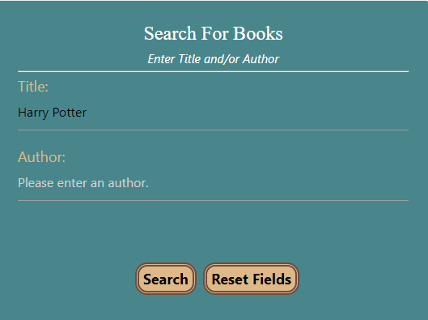
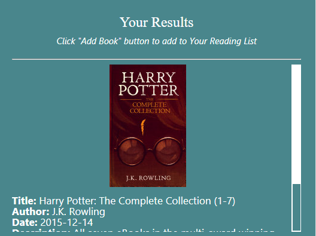
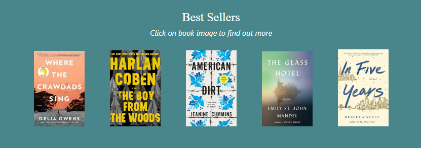
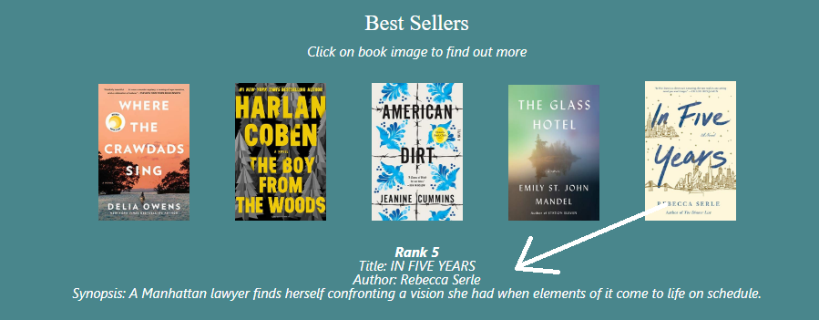

# Book Sleuth

<h2> Welcome to Book Sleuth! </h2> 

With so many books out there, this application can help narrow down user's book of interest by providing information about the book. If unsure where to start, go for the New York Times top rated books instead.  
#### Check it out: https://mhvue.github.io/Book-Sleuth 

## Table of Contents
* [How it works](#how-it-works)
    * [Search for a Book](#search-for-a-book)
    * [New York Times Bestsellers](#refer-to-new-york-times-bestsellers-suggestions)
* [Technologies](#technologies)
* [Setup](#setup)
* [Features](#features)
* [To Do](#to-do)
* [Inspiration](#inspiration)
* [Contributors](#contributors)
* [Status](#status)

## How It Works:

### Search for a Book 
User can search for a book Title and or Author by:
1. Type in by Title and/or Author of interest.

2. Click    or press Enter on your keyboard.

3. Books will show up in the Your Results. 

 
4. Click on    to search again for different book Title and/or Author.

## Refer to New York Times Bestsellers Suggestions

New York Times offers up to date top 5 books.
1. Click the image of the books to show more information about the book. 

2. Information shown: Summary, Author and New York Times rank of 1-5 for each book.

*visit often to check out new top 5 from New York Times!* 

## Technologies
Project is created with: 
* Bootstrap
* HTML
* JQuery
* CSS
* Google Books API
* New York Times API 

## Setup
1. Fork this repository  
2. Clone this repository on your local machine 
<pre><code>git clone https://github.com/mhvue/Book-Sleuth.git</code></pre>
3. You now have access to this project files on your local machine to edit and add changes. 

## Features:
* Google Books API for broader search options
* New York Times API that is updated often to show top 5 books

## To Do:
* Have email functionality so users can email list of saved books

## Inspiration: 
This project  was inspired by a team that loves to read. We wanted a simple and fast way to find books to read in fast pace life.  

## Contributors: 
This started as a project with other contributors: 
* Kristin Helker https://github.com/klhelker 
* Brandon Williams https://github.com/brando5393
* Dylan Myers https://github.com/Dylan-Myers

## Status:
* Currently, Project is in *process* independently